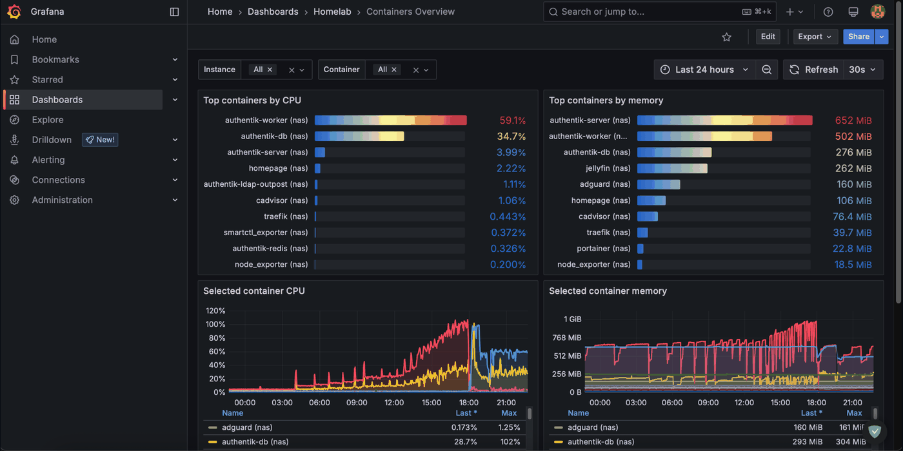

# Platform Engineering at Home

<p align="center">
  
</p>

[Architecture](ARCHITECTURE.md) | [Design Philosophy](DESIGN_PHILOSOPHY.md) | [Auth Model](docs/identity/AUTH_MODEL.md) | [Docs](docs/)
A working home platform, not a demo. Two nodes, one control plane: DNS, TLS, SSO, self-hosted apps, monitoring, and backups, all automated with Ansible. DNS, TLS, and SSO are designed as one stack, and if something breaks at 2am and I'm not around, my wife can follow the [recovery guide](docs/operations/NON_TECHNICAL_RECOVERY.md) and get the essentials back. That's the bar.

---

## What This Repo Demonstrates

- Multi-node platform design with a clear role split between an always-on NAS and a Ryzen compute VM
- Identity done as a system: Authentik, per-service auth modes, native OIDC where it fits, break-glass where it matters
- Reproducible operations: inventory-driven Ansible, Jinja2 templates, vault-managed secrets, syntax checks, smoke tests
- Day-2 thinking: monitoring, backup tiers, restore notes, incident playbooks, and non-technical recovery
- Resource discipline: ZFS stability on the NAS, databases and caches on Ryzen NVMe, no inbound router exposure

---

## Platform At A Glance

<p align="center">
  
</p>

## Architecture Summary

- **NAS / Intel N100 / TrueNAS SCALE**: AdGuard, Traefik, Authentik, Vaultwarden, Portainer, Jellyfin, Homepage, ntfy
- **Ryzen VM / Debian on Proxmox**: Immich, Paperless-ngx, Navidrome, Audiobookshelf, Calibre-Web, SiYuan, Excalidraw, Mealie, Linkwarden, monitoring
- **Storage model**: databases and caches stay on Ryzen NVMe; photos, documents, and app data live on NAS storage via NFS
- **Ingress model**: Traefik runs on the NAS and fronts both nodes; remote apps route through the file provider

---

## Explore The Docs

| Start here | What you get |
|---|---|
| [`ARCHITECTURE.md`](ARCHITECTURE.md) | Node split, storage placement, service endpoints, network flow |
| [`DESIGN_PHILOSOPHY.md`](DESIGN_PHILOSOPHY.md) | Trade-offs, operating principles, and why the stack looks like this |
| [`docs/identity/AUTH_MODEL.md`](docs/identity/AUTH_MODEL.md) | Per-service auth decisions, break-glass rules, rollout logic |
| [`docs/operations/INCIDENT_RESPONSE.md`](docs/operations/INCIDENT_RESPONSE.md) | What to do when ingress, DNS, SSO, monitoring, or memory pressure goes sideways |
| [`docs/reference/MONITORING_STACK.md`](docs/reference/MONITORING_STACK.md) | Prometheus, Loki, Alertmanager, Grafana, Dozzle, ntfy, and alert coverage |
| [`docs/reference/BACKUP_STRATEGY.md`](docs/reference/BACKUP_STRATEGY.md) | Backup tiers, restore targets, off-site status, and current gaps |
| [`docs/reference/DEPLOY_COMMANDS.md`](docs/reference/DEPLOY_COMMANDS.md) | Canonical deploy, dry-run, tag-based, and validation commands |
| [`docs/reference/VERSION_CHECK.md`](docs/reference/VERSION_CHECK.md) | Automated version drift detection across all pinned images |
| [`docs/setup/CLOUDFLARE_DNS01.md`](docs/setup/CLOUDFLARE_DNS01.md) | Cloudflare API token setup for DNS-01 TLS certificates |

---

## Quick Start

```bash
ansible-galaxy collection install -r requirements.yml

ansible-playbook -i inventory.ini deploy_n100.yml --check --diff
ansible-playbook -i inventory.ini deploy_docker_nodes.yml --check --diff

ansible-playbook -i inventory.ini deploy_n100.yml
ansible-playbook -i inventory.ini deploy_docker_nodes.yml
ansible-playbook -i inventory.ini smoke_test.yml
```

Copy `secrets.yml.example` to `secrets.yml`, fill in the values, then encrypt it with Ansible Vault. Full command reference lives in [`docs/reference/DEPLOY_COMMANDS.md`](docs/reference/DEPLOY_COMMANDS.md).

---

## Repo Structure

```text
roles/                  infrastructure and app roles
group_vars/             shared, NAS, and Ryzen configuration
deploy_n100.yml         NAS deploy: ingress, identity, media
deploy_docker_nodes.yml Ryzen deploy: apps, tools, monitoring
smoke_test.yml          post-deploy health checks
docs/                   architecture, identity, setup, operations, reference
.github/workflows/      lint and syntax validation
```
