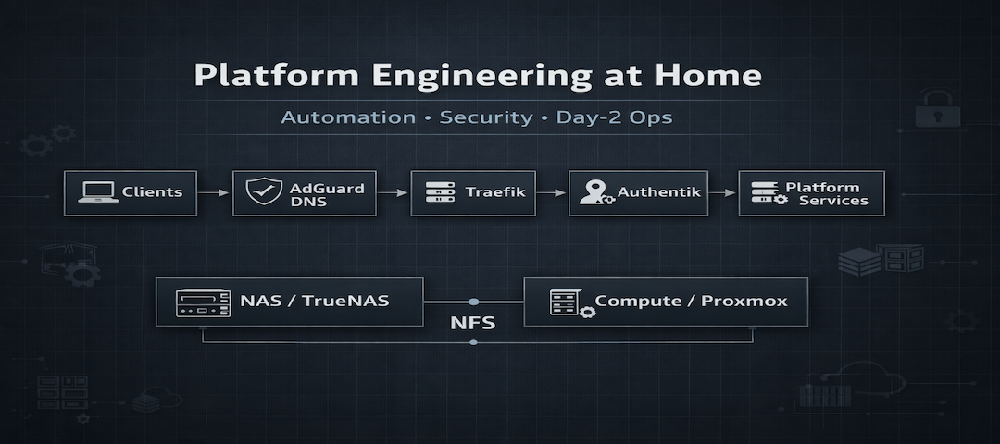

# Platform Engineering at Home

<p align="center">
  
</p>

[Architecture](ARCHITECTURE.md) | [Design Philosophy](DESIGN_PHILOSOPHY.md) | [Docs](docs/)

[](https://github.com/MateuszWiacek/home_platform_private/actions/workflows/lint.yml)

A working home platform, not a demo. DNS, TLS, SSO, self-hosted media, photos, and documents, all automated end to end with Ansible. No inbound router exposure, no self-signed certs, no "just click through the warning". If something breaks at 2am and I'm not around, my wife can follow the [recovery guide](docs/operations/NON_TECHNICAL_RECOVERY.md) and fix it. That's the bar.

---

## If you're here from LinkedIn

Everything here runs at home daily. Not a demo, not a weekend experiment that never got finished.

DNS, TLS, and SSO are wired as one stack, not services glued together with hope. Deploys are reproducible: Ansible roles, Jinja2 templates, inventory-driven vars. If something breaks, there's a documented way to fix it. If I made a trade-off, there's a documented reason why.

- Architecture and node split: [`ARCHITECTURE.md`](ARCHITECTURE.md)
- Design decisions and trade-offs: [`DESIGN_PHILOSOPHY.md`](DESIGN_PHILOSOPHY.md)
- Identity model and rollout: [`docs/identity/AUTH_MODEL.md`](docs/identity/AUTH_MODEL.md)

If you're here to build your own homestack, skip the philosophy and jump to the [Quick Start](#quick-start) section.

---

## Stack

| Service | What it does |
|---|---|
| AdGuard Home | Internal DNS, clean URLs, no port memorization |
| Traefik | Ingress + TLS via Cloudflare DNS-01 |
| Authentik | SSO and central identity where it fits |
| Vaultwarden | Password vault, my keys my backup |
| Portainer | Container admin when I'm not at a real terminal |
| Jellyfin | Media server, Intel Quick Sync does the heavy lifting |
| Homepage | Dashboard, one place for the whole household |
| Immich | Google Photos replacement that actually stays mine |
| Paperless-ngx | Document archive with OCR, no more paper piles |
| Stirling-PDF | PDF toolbox without uploading files to strangers |
| IT-Tools | Admin and developer utilities, one bookmark |
| Navidrome | Music streaming, Subsonic-compatible |
| Audiobookshelf | Audiobooks and podcasts with proper progress sync |
| Calibre-Web | Ebook library with browser-based reader |
| SiYuan | Knowledge base and notes, Notion without the SaaS |
| Excalidraw | Collaborative whiteboard, zero signup |
| Mealie | Recipe manager, finally no more screenshots of recipes |
| Linkwarden | Bookmark archive, pages saved before they disappear |
| Syncthing | File sync between devices, no cloud middleman |

---

## Quick Start

```bash
ansible-galaxy collection install -r requirements.yml

# Dry run first - always
ansible-playbook -i inventory.ini deploy_n100.yml --check --diff
ansible-playbook -i inventory.ini deploy_docker_nodes.yml --check --diff

# Full deploy
ansible-playbook -i inventory.ini deploy_n100.yml
ansible-playbook -i inventory.ini deploy_docker_nodes.yml

# Post-deploy verification
ansible-playbook -i inventory.ini smoke_test.yml
```

Secrets: copy `secrets.yml.example` to `secrets.yml`, fill in, encrypt with ansible-vault. Never plaintext, never in git.

> All deploy commands require `--ask-vault-pass` or `--vault-password-file ~/.vault_pass` if `secrets.yml` is encrypted.

Full command reference: [`docs/reference/DEPLOY_COMMANDS.md`](docs/reference/DEPLOY_COMMANDS.md)

---

## Repo Layout

```text
roles/                  # infrastructure and app roles
group_vars/             # shared, NAS, and Ryzen configuration
deploy_n100.yml         # NAS: ingress, identity, media
deploy_docker_nodes.yml # Ryzen: apps and tools
smoke_test.yml          # post-deploy health checks
docs/                   # setup, identity, operations, and reference docs
ARCHITECTURE.md         # nodes, storage, network flow, endpoints
DESIGN_PHILOSOPHY.md    # trade-offs and design decisions
```

---

## Read This Before Deploy

Things that look trivial until they ruin your evening:

- **AdGuard first-run wizard**: fresh installs need one-time bootstrap on `:3000` before the UI is normal. See [common issues](docs/setup/COMMON_ISSUES.md).
- **Traefik `acme.json`**: must exist, `0600`, handled carefully. `state: touch` with preserved timestamps to avoid false `changed`.
- **Authentik outpost config**: if SSO feels "almost working", the answer is usually in outpost or worker logs.

Full failure modes and incident playbooks: [`docs/operations/INCIDENT_RESPONSE.md`](docs/operations/INCIDENT_RESPONSE.md).

---

## Docs

**Public-facing:**
- [`ARCHITECTURE.md`](ARCHITECTURE.md) - system design: nodes, storage, network flow, endpoints, Ansible structure
- [`DESIGN_PHILOSOPHY.md`](DESIGN_PHILOSOPHY.md) - trade-off reasoning, design principles, engineering voice

**Identity:**
- [`docs/identity/AUTH_MODEL.md`](docs/identity/AUTH_MODEL.md) - authentication model, per-service decisions, break-glass
- [`docs/identity/AUTH_ROLLOUT.md`](docs/identity/AUTH_ROLLOUT.md) - rollout phases, status, checklists
- [`docs/identity/FORWARDAUTH_SETUP.md`](docs/identity/FORWARDAUTH_SETUP.md) - ForwardAuth pattern: how to wire a service
- [`docs/identity/OIDC_SETUP.md`](docs/identity/OIDC_SETUP.md) - native OIDC pattern: how to wire a service
- [`docs/identity/LDAP_SETUP.md`](docs/identity/LDAP_SETUP.md) - LDAP outpost, Base DN, TrueNAS/SSSD integration

**Setup:**
- [`docs/setup/COMMON_ISSUES.md`](docs/setup/COMMON_ISSUES.md) - setup-time gotchas and known fixes
- [`docs/setup/PROXMOX_OIDC.md`](docs/setup/PROXMOX_OIDC.md) - Proxmox reverse proxy + OIDC setup

**Operations:**
- [`docs/operations/INCIDENT_RESPONSE.md`](docs/operations/INCIDENT_RESPONSE.md) - fire drill, incident playbooks, smoke checklist
- [`docs/operations/NON_TECHNICAL_RECOVERY.md`](docs/operations/NON_TECHNICAL_RECOVERY.md) - non-technical recovery steps

**Reference:**
- [`docs/reference/DEPLOY_COMMANDS.md`](docs/reference/DEPLOY_COMMANDS.md) - canonical deploy command reference
- [`docs/reference/VARIABLES.md`](docs/reference/VARIABLES.md) - variable map, secrets, backup coverage
- [`docs/reference/BACKUP_STRATEGY.md`](docs/reference/BACKUP_STRATEGY.md) - backup tiers, recovery targets, off-site status
- [`docs/reference/ANSIBLE_NOTES.md`](docs/reference/ANSIBLE_NOTES.md) - Ansible patterns, gotchas, conventions
